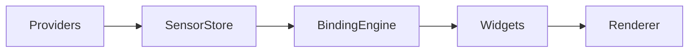
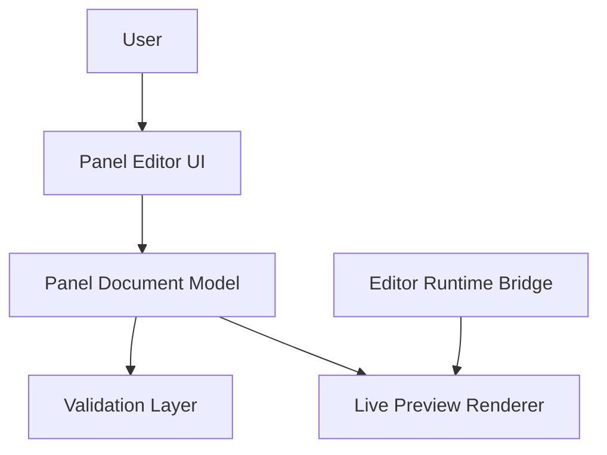
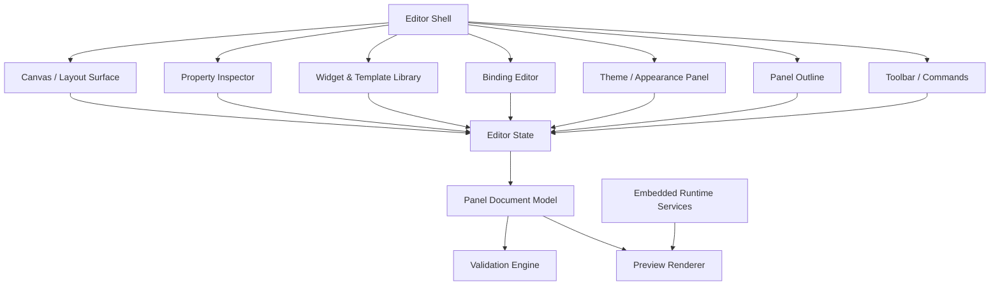
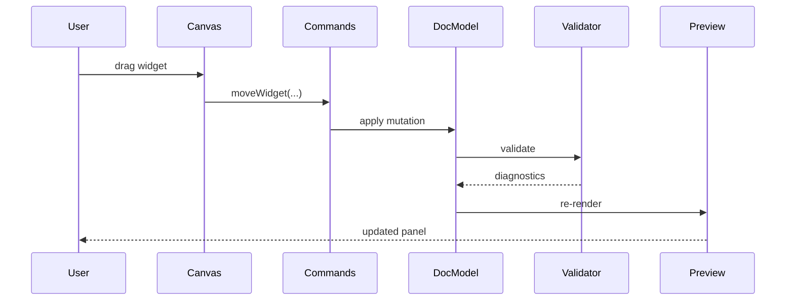
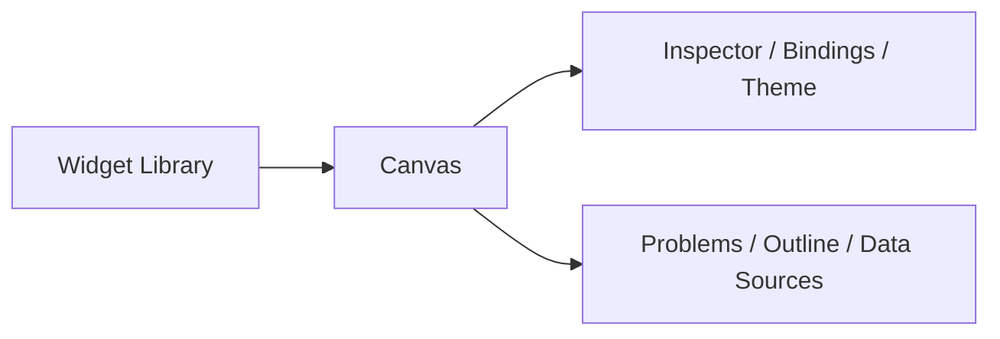

# AstraGauge Panel Editor Architecture Specification

## Document Status

- **Project:** AstraGauge
- **Document Type:** Architecture Specification
- **Version:** v0.1
- **Status:** Draft

---

# 1. Purpose

This document defines the architecture of the **AstraGauge Panel Editor**.

The Panel Editor is the visual authoring environment used to create, edit, preview, validate, and save AstraGauge panels. It sits on top of the existing runtime concepts of:

- providers
- sensor store
- binding engine
- widget runtime
- theme engine

The editor is not just a convenience layer. It is a core product surface because it determines whether users can build clean, reusable sensor panels efficiently.

---

# 2. Goals

The Panel Editor must provide:

- **visual panel composition**
- **fast widget placement and resizing**
- **binding configuration**
- **theme-aware previewing**
- **safe document editing with validation**
- **shareable, portable panel documents**

The editor should make it easy to build:

- compact hardware monitor panels
- AIDA64-style sensor panels with a cleaner UX
- larger desktop instrumentation layouts
- small-display layouts for embedded screens

---

# 3. Non-Goals

The initial Panel Editor should not attempt to be:

- a full graphics editor
- a freeform canvas like Figma
- a data-analysis tool
- a metrics database query interface
- a scripting IDE

The editor is for **panel authoring**, not general design work.

---

# 4. Architectural Context

The runtime architecture already establishes this core pipeline:



This is consistent with the project architecture and provider model already defined in the current runtime and provider specs. fileciteturn1file0 fileciteturn1file1

The editor adds an authoring layer on top:



---

# 5. Design Principles

## 5.1 Document-first architecture

The editor should treat the **panel document** as the authoritative state.

UI interactions do not directly mutate widgets on screen. They update the document model, which is then re-rendered.

This reduces state drift and prevents the classic “canvas state vs saved state” nonsense machine.

## 5.2 Grid-first composition

Panels should be built on a grid-based layout rather than arbitrary pixel placement.

Benefits:

- predictable alignment
- easier resizing
- portable layouts
- simpler validation
- cleaner rendering on different screen sizes

## 5.3 Live preview, controlled edits

The preview should update quickly, but changes should still move through a controlled state pipeline:

```text
User Action -> Intent -> Document Update -> Validation -> Preview Refresh
```

## 5.4 Theme-aware authoring

The editor must preview widgets using the selected theme so users can see:

- spacing
- typography
- contrast
- widget density
- panel readability

## 5.5 Constraint over chaos

The editor should encourage good panel composition through:

- snap-to-grid
- minimum widget sizes
- alignment tools
- validated bindings
- sane defaults

AstraGauge should help users make polished panels, not lovingly handcraft digital goblin caves.

---

# 6. High-Level Editor Architecture



---

# 7. Major Components

## 7.1 Editor Shell

The shell coordinates the overall editor layout and command routing.

Responsibilities:

- application navigation
- current-document session management
- undo/redo integration
- command dispatch
- save/load flows

## 7.2 Canvas Layer

The canvas is the primary composition surface.

Responsibilities:

- display panel grid
- render widget bounds
- support selection
- support drag, resize, reorder
- support snap and alignment
- display live preview overlays

The canvas should support two modes:

- **edit mode** — shows handles, guides, selection frames
- **preview mode** — hides editor chrome and shows the panel as rendered

## 7.3 Property Inspector

The inspector edits the selected object.

Targets include:

- panel properties
- widget properties
- layout properties
- visual configuration
- widget-specific settings

## 7.4 Widget Library

The library exposes available widget types and starter templates.

Initial categories:

- stat tile
- gauge
- bar gauge
- sparkline
- sensor list
- text/image panel

These align with the current widget direction in the runtime spec. fileciteturn1file0

## 7.5 Binding Editor

The binding editor configures sensor-to-widget mappings.

Responsibilities:

- browse available sensors
- filter by category, device, provider, tag
- assign bindings to widget properties
- configure transforms
- configure aggregations
- show validation errors

This editor is the UI face of the binding engine spec.

## 7.6 Theme / Appearance Panel

This configures panel-level and widget-level visual settings.

Responsibilities:

- theme selection
- theme preview
- color overrides
- typography overrides
- density / spacing settings
- panel background controls

## 7.7 Panel Outline

The outline provides a structured list of panel contents.

Responsibilities:

- show widget tree or flat list
- support selection
- show hidden/locked states
- support reordering when relevant

This becomes more useful as panel complexity grows.

## 7.8 Validation Engine

The validator checks the document for structural and semantic issues.

Validation categories:

- invalid widget layout
- overlapping widgets
- missing bindings
- invalid binding expressions
- unsupported widget properties
- unknown theme references
- document version mismatches

## 7.9 Embedded Runtime Services

The editor should embed lightweight runtime services so preview behaves like the real runtime.

Services required for preview:

- sensor store access
- binding engine evaluation
- widget rendering
- theme rendering
- mock/live data switching

---

# 8. Panel Document Model

The editor should use the panel document as the canonical source of truth.

Example shape:

```json
{
  "version": 1,
  "name": "Hardware Monitor",
  "theme": "default-dark",
  "grid": {
    "columns": 12,
    "rowHeight": 80,
    "spacing": 8
  },
  "widgets": [
    {
      "id": "cpu_load",
      "type": "stat",
      "x": 0,
      "y": 0,
      "w": 3,
      "h": 2,
      "bindings": {
        "value": "cpu.utilization"
      },
      "props": {
        "label": "CPU"
      }
    }
  ]
}
```

This aligns with the panel-format direction already established in the project.

---

# 9. Editor State Model

The editor should separate **document state** from **ephemeral UI state**.

## 9.1 Document State

Persistent state that can be saved:

- panel metadata
- widget definitions
- bindings
- theme selection
- layout configuration

## 9.2 Session / UI State

Transient state that should not be stored in the panel document:

- current selection
- hovered widget
- drag operation state
- resize handles
- inspector tab state
- zoom level
- guide visibility
- unsaved-change status

Recommended model:

```text
EditorState
├── DocumentState
└── SessionState
```

---

# 10. Interaction Model

## 10.1 Primary interactions

The first version of the editor should support:

- add widget
- select widget
- multi-select widgets
- move widget
- resize widget
- duplicate widget
- delete widget
- edit widget properties
- configure bindings
- switch theme
- preview panel
- save panel

## 10.2 Selection model

Selection behavior should feel like a normal desktop design tool:

- single click = select widget
- shift-click = add/remove from selection
- drag on empty space = marquee select
- escape = clear selection

## 10.3 Drag / resize model

During drag or resize:

- widget bounds snap to grid
- guides appear for alignment
- invalid placements are visually indicated
- document updates may be staged until drop, then committed

## 10.4 Keyboard model

Suggested shortcuts:

- `Delete` = remove selection
- `Ctrl/Cmd + D` = duplicate
- `Ctrl/Cmd + Z` = undo
- `Ctrl/Cmd + Shift + Z` = redo
- arrow keys = nudge
- shift + arrow = larger nudge
- `Ctrl/Cmd + S` = save
- `Space` = temporary pan

---

# 11. Authoring Modes

The editor should support explicit modes so the UI remains understandable.

## 11.1 Layout Mode

Focus:

- widget placement
- sizing
- alignment
- grouping
- arrangement

## 11.2 Bindings Mode

Focus:

- assigning sensors
- configuring transforms
- browsing sensor availability
- validating widget inputs

## 11.3 Styling Mode

Focus:

- theme selection
- color and typography preview
- widget appearance tuning
- density and spacing

## 11.4 Preview Mode

Focus:

- full rendered panel
- hidden editor controls
- realistic live/mock data behavior

You do not necessarily need separate screens for these, but the product should communicate which type of editing the user is doing.

---

# 12. Live Preview Strategy

The editor should provide two preview data modes.

## 12.1 Mock Data Mode

Used when:

- no providers are configured
- developing panel templates
- designing generic panels
- testing layout behavior

Requirements:

- stable fake values
- realistic ranges
- category-aware sample generation
- optional animated trends

## 12.2 Live Data Mode

Used when:

- providers are available
- designing against the actual machine
- validating bindings

Requirements:

- access real sensor descriptors
- display current provider health
- indicate stale or missing values
- allow sensor filtering

The user must be able to switch between mock and live data cleanly.

---

# 13. Validation Model

Validation should be continuous but not obnoxious.

## 13.1 Validation levels

### Error
Panel cannot be rendered or saved safely.

Examples:

- duplicate widget IDs
- invalid document version
- malformed binding structure
- impossible widget bounds

### Warning
Panel can render but behavior is degraded.

Examples:

- missing sensor in live mode
- theme override not found
- widget too small for configured content
- unresolved optional binding

### Info
Helpful feedback only.

Examples:

- unused widget prop
- optional binding missing
- possible alignment improvement

## 13.2 Validation surfaces

Validation feedback should appear in:

- inline inspector messages
- widget warning badges
- document problem list
- save-time validation summary

---

# 14. Undo / Redo Model

The editor must support robust undo/redo.

Recommended strategy:

- treat user actions as commands
- each command produces a document mutation
- maintain a reversible history stack

Typical commands:

- add widget
- move widget
- resize widget
- edit binding
- change property
- change theme
- delete widget

This is much safer than ad hoc state rewrites.

---

# 15. Persistence Model

The editor should support:

- new panel
- open panel
- save
- save as
- export template
- import template

The saved artifact should remain the panel-format document rather than a separate editor-only file where possible.

Possible future addition:

- sidecar editor metadata for view preferences

That should remain optional.

---

# 16. Internal Data Flow



---

# 17. Extensibility

The editor architecture should be prepared for ecosystem growth.

## 17.1 Widget extensibility

The editor should be able to discover widget metadata such as:

- display name
- category
- icon
- default size
- editable properties
- bindable properties
- preview renderer
- inspector schema

## 17.2 Theme extensibility

The editor should load theme metadata including:

- theme name
- preview swatches
- typography samples
- supported overrides

## 17.3 Provider awareness

The editor should consume provider metadata for live-binding workflows, but providers themselves should remain runtime integrations rather than editor plugins.

That keeps the editor from becoming a junk drawer.

---

# 18. Performance Considerations

The editor must remain responsive even with complex panels.

Requirements:

- incremental preview updates
- cached widget previews where possible
- debounced validation for heavy operations
- efficient selection overlays
- batched binding recomputation
- virtualization for large widget lists if needed

The likely bottlenecks are:

- canvas redraws
- binding recomputation
- live preview updates
- inspector rerenders

---

# 19. Accessibility Considerations

The editor should support:

- keyboard navigation
- visible focus states
- scalable UI text
- high-contrast themes
- readable validation messaging

Even if the final panel is highly visual, the editor itself should not behave like an arcade cabinet.

---

# 20. Suggested Initial UI Layout



Practical arrangement:

- **left:** widget library and templates
- **center:** canvas and preview
- **right:** inspector / bindings / theme controls
- **bottom optional:** diagnostics, outline, sensor browser

This is boring in the best possible way. Users already understand it.

---

# 21. MVP Recommendation

The MVP editor should include:

- grid canvas
- add/move/resize widgets
- stat/gauge/bar/sparkline widgets
- panel document editing
- property inspector
- binding editor for basic single-sensor bindings
- theme switching
- mock-data preview
- save/load support
- validation for layout and bindings
- undo/redo

Do not delay the editor waiting for:

- complex expressions
- multi-page panel authoring
- collaborative editing
- animation timelines
- plugin marketplaces
- freeform vector tools

Those are future gremlins.

---

# 22. Future Enhancements

Possible future capabilities:

- reusable widget groups
- alignment and distribution tools
- panel templates
- device preview presets
- responsive layout modes
- conditional visibility
- conditional formatting
- historical preview playback
- shared component library
- provider capability inspector

---

# 23. Summary

The AstraGauge Panel Editor should be built as a **document-first, grid-based, theme-aware authoring environment** for system sensor panels.

Its responsibilities are to:

- compose panels visually
- configure bindings safely
- preview themes and data
- validate document correctness
- produce shareable panel artifacts

If the runtime is the engine, the editor is the cockpit. Mess this up and the vehicle is technically impressive but still annoying to drive.
