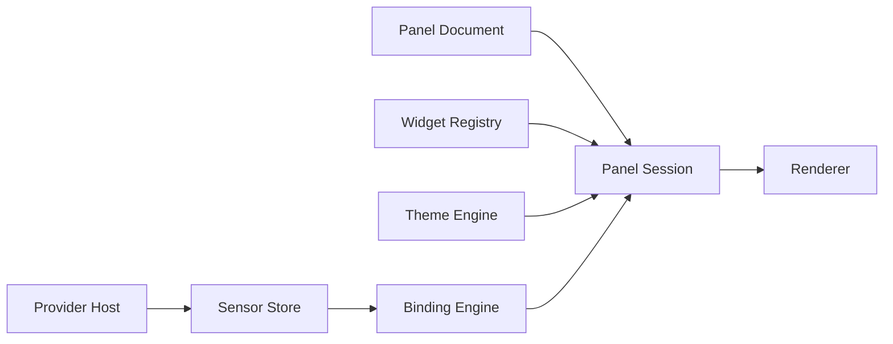
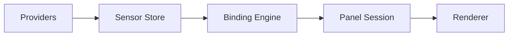

# AstraGauge Runtime Architecture Specification

## Document Status

- **Project:** AstraGauge
- **Document Type:** Architecture Specification
- **Version:** v0.1
- **Status:** Draft

---

# 1. Purpose

This document defines the internal architecture of the **AstraGauge Runtime**.

The runtime is the executable system responsible for:

- loading providers
- collecting and storing sensor data
- evaluating bindings
- instantiating widgets
- applying themes
- rendering panels
- managing update flow and lifecycle

This spec answers a boring but essential question:

**What does the AstraGauge process actually contain, and how do the pieces talk to each other without becoming spaghetti in a trench coat?**

---

# 2. Goals

The runtime architecture must provide:

- **clear service boundaries**
- **predictable data flow**
- **efficient update propagation**
- **safe lifecycle management**
- **extensibility for providers and widgets**
- **editor compatibility**
- **good performance on desktop-class systems**

The runtime should support both:

- standalone panel display
- embedded preview mode inside the editor

---

# 3. Non-Goals

This spec does not define:

- provider implementation internals
- widget rendering internals
- panel editor interaction details
- full theme file syntax
- packaging and installation formats

Those are covered by adjacent specifications.

---

# 4. Architectural Overview

The AstraGauge runtime should be structured as a set of cooperating services around a central panel session.



At a high level:

- **providers** publish sensor data
- the **sensor store** owns runtime sensor state
- the **binding engine** resolves widget inputs
- the **panel session** coordinates active panel state
- the **renderer** displays the result
- the **theme engine** applies appearance rules
- the **widget registry** resolves widget implementations and metadata

---

# 5. Core Runtime Services

The runtime should be divided into explicit services.

## 5.1 Runtime Shell

The top-level application service.

Responsibilities:

- process startup and shutdown
- service initialization
- configuration loading
- panel loading
- error reporting
- environment mode selection

Modes may include:

- normal runtime mode
- editor-preview mode
- mock-data mode

## 5.2 Provider Host

Loads and manages providers.

Responsibilities:

- discover installed providers
- validate provider compatibility
- initialize provider instances
- manage polling lifecycle
- collect provider health status
- forward descriptors and samples to the sensor store

The provider host is the runtime boundary for all provider integrations.

## 5.3 Sensor Store

Central storage for descriptors, latest values, short history, and subscriptions.

Responsibilities:

- descriptor registry
- current sample table
- history buffers
- update batching
- subscription dispatch
- staleness tracking

This is the data backbone of the runtime.

## 5.4 Binding Engine

Resolves widget bindings against store data.

Responsibilities:

- resolve sensor IDs
- resolve wildcard patterns
- apply transforms
- apply aggregations
- compute derived values
- publish bound widget inputs

The binding engine should not render anything. Its job is translation, not artistry.

## 5.5 Widget Registry

Holds widget metadata and factory/loader information.

Responsibilities:

- register built-in widgets
- discover extension widgets
- expose widget manifests
- validate widget types in panels
- supply widget factories to panel sessions

The registry lets the runtime stay schema-driven instead of hardcoding widget behavior all over the place.

## 5.6 Theme Engine

Loads and applies theme resources.

Responsibilities:

- load theme definitions
- resolve semantic color and typography roles
- expose style tokens
- validate theme references
- provide runtime style lookups

## 5.7 Panel Session Manager

Creates and manages active panel sessions.

Responsibilities:

- open panel documents
- instantiate widgets
- track active bindings
- coordinate runtime updates
- manage panel-local state
- own session lifecycle

The panel session is the main composition unit of the runtime.

## 5.8 Renderer

Draws the active panel to the display surface.

Responsibilities:

- layout resolved widgets
- request widget rendering
- apply theme tokens
- manage repaint scheduling
- handle resize/redraw events

The renderer should consume already-resolved widget inputs, not reach backward into provider logic.

---

# 6. Runtime Composition Model

The runtime should be organized around a **Panel Session**.

A panel session is the active in-memory runtime instance of a panel document.

Each session owns:

- parsed panel document
- instantiated widget instances
- binding subscriptions
- panel-local configuration
- resolved theme
- render state

This gives AstraGauge a clean unit for:

- opening a panel
- replacing a panel
- embedding preview in the editor
- possibly supporting multiple panels later

---

# 7. Recommended Internal Module Boundaries

A clean internal module split would look like this conceptually:

```text
runtime/
  shell/
  provider_host/
  sensor_store/
  binding_engine/
  widget_registry/
  theme_engine/
  panel_session/
  renderer/
  diagnostics/
```

This is a **logical architecture**, not a required crate or directory layout.

That distinction matters because directory trees are notorious liars.

---

# 8. Panel Session Lifecycle

The runtime should treat panel execution as an explicit lifecycle.

## 8.1 Session Creation

Steps:

1. load panel document
2. validate panel schema
3. resolve theme
4. resolve widget manifests
5. create widget instances
6. create binding subscriptions
7. initialize render tree
8. begin rendering

## 8.2 Session Update

During normal operation:

1. provider emits new samples
2. sensor store updates values
3. binding engine recomputes affected widget inputs
4. session updates widget state
5. renderer schedules repaint

## 8.3 Session Disposal

When closing or replacing a panel:

1. unsubscribe bindings
2. dispose widget instances
3. release panel-local resources
4. detach render tree
5. clear session state

This prevents resource leaks and phantom subscriptions, which are the software equivalent of glitter.

---

# 9. Data Flow

The runtime should follow a unidirectional data flow wherever practical.



This keeps the architecture legible.

## 9.1 Why unidirectional flow

Benefits:

- easier debugging
- fewer feedback loops
- predictable updates
- simpler profiling
- clearer service boundaries

Avoid allowing widgets to directly fetch providers or mutate store state.

That way lies chaos and mysterious bugs at 2 a.m.

---

# 10. Event and Update Model

The runtime needs a lightweight internal update model.

Recommended categories of events:

| Event Type | Source | Purpose |
|---|---|---|
provider_registered | Provider Host | provider availability |
sensor_registered | Provider Host | descriptor registration |
samples_received | Provider Host | sample updates |
bindings_invalidated | Sensor Store / Binding Engine | recompute trigger |
panel_loaded | Runtime Shell | session start |
theme_changed | Theme Engine / Session | restyle trigger |
render_requested | Session / Renderer | repaint trigger |

## 10.1 Event bus vs direct subscriptions

Recommended approach:

- **direct subscriptions** for high-frequency data paths
- **lightweight event dispatch** for lifecycle and diagnostics events

Use direct subscriptions for:

- sample propagation
- binding invalidation
- widget input updates

Use lifecycle events for:

- provider health changes
- panel load/unload
- theme changes
- diagnostics

This avoids turning every sensor update into an event-bus parade float.

---

# 11. Threading Model

The runtime should support concurrent provider activity while keeping UI rendering predictable.

Recommended model:

- provider polling may run on worker threads/tasks
- sensor store accepts synchronized writes
- binding recomputation may run off the UI thread when feasible
- widget rendering and final UI updates occur on the main/UI thread

## 11.1 Threading goals

- avoid blocking the UI thread
- keep store writes safe
- avoid excessive lock contention
- batch updates before UI delivery

The exact primitives depend on implementation language and UI framework, but the architecture should preserve this separation.

---

# 12. Update Scheduling

The runtime should decouple **sample arrival** from **render frequency**.

A provider might emit many updates; the UI does not need to repaint for every one.

Recommended pipeline:

1. receive provider samples
2. batch store updates in a small window
3. recompute affected bindings
4. mark widget inputs dirty
5. schedule render on next UI frame / tick

This reduces jitter and prevents repaint storms.

## 12.1 Recommended batching window

A reasonable initial batching window is:

- **16–50 ms**

This is enough to smooth bursts without making the UI feel sluggish.

---

# 13. Runtime Configuration

The runtime should support a small configuration model.

Suggested configuration areas:

- provider search paths
- selected panel path
- selected theme override
- update frequency settings
- mock/live data mode
- diagnostics verbosity

Example conceptual config:

```toml
panel = "default.panel.json"
theme = "default-dark"
mock_mode = false

[providers]
search_paths = ["~/.astragauge/providers", "./providers"]
```

Configuration should influence service startup, not be smeared across random modules.

---

# 14. Diagnostics and Observability

Yes, amusingly, the runtime itself benefits from observability.

The runtime should expose diagnostics for:

- provider load failures
- incompatible manifests
- invalid panel documents
- binding resolution errors
- stale sensors
- widget instantiation failures
- render timing
- update rates

## 14.1 Diagnostics surfaces

Diagnostics may appear in:

- logs
- developer console
- editor diagnostics panel
- runtime status overlay

This is particularly important during ecosystem growth.

---

# 15. Error Containment

AstraGauge should isolate failures where practical.

## 15.1 Provider failures

A broken provider should:

- enter degraded/error state
- stop contributing samples if necessary
- not crash the entire runtime

## 15.2 Widget failures

A broken widget should:

- fail validation if possible before instantiation
- show fallback error state if runtime failure occurs
- not break unrelated widgets in the same panel

## 15.3 Binding failures

A failed binding should:

- log diagnostics
- mark the affected input unresolved
- surface a visible `N/A` or warning state

The runtime should fail **locally**, not catastrophically.

---

# 16. Theme Application Model

The runtime should treat theming as token resolution rather than one-off widget styling hacks.

Flow:

1. session resolves active theme
2. theme engine exposes semantic roles/tokens
3. widget renderers request tokens by role
4. renderer applies resolved styles

This preserves consistency and keeps themes portable.

Widgets should prefer theme roles like:

- `surface`
- `text_primary`
- `text_secondary`
- `accent`
- `good`
- `warn`
- `critical`

rather than raw colors.

---

# 17. Widget Instantiation Model

The widget registry should provide enough metadata to instantiate widgets safely.

Suggested flow:

1. panel session reads widget type ID from panel doc
2. widget registry resolves widget manifest
3. widget factory/constructor is selected
4. default props merged with panel props
5. bindings attached
6. widget instance created
7. renderer receives widget node

This should be consistent for built-in and extension widgets.

---

# 18. Mock Mode and Editor Preview Mode

The runtime architecture should support non-production execution contexts.

## 18.1 Mock Mode

Used when:

- no providers are installed
- panel templates are being designed
- demo panels are shown

Behavior:

- mock descriptors and samples are injected through the same store interfaces
- bindings and widgets operate normally

## 18.2 Editor Preview Mode

Used when:

- the panel editor embeds the runtime
- edit-time preview is needed

Requirements:

- lightweight startup
- rapid panel reload
- support for partial invalid state
- support for selection overlays in editor-owned UI

The editor should not reinvent runtime behavior. It should borrow it.

---

# 19. Service Initialization Order

A predictable initialization order helps avoid subtle startup bugs.

Recommended order:

1. runtime config
2. diagnostics/logging
3. widget registry
4. theme engine
5. sensor store
6. binding engine
7. provider host
8. panel session manager
9. renderer
10. active panel session start

This order ensures dependencies exist before they are consumed.

---

# 20. Shutdown Order

Recommended shutdown sequence:

1. stop active panel session
2. stop renderer updates
3. stop provider polling
4. flush diagnostics/logs
5. dispose runtime services

Shutdown order matters more than people think. Many “random exit bugs” are just lifecycle sloppiness wearing a fake mustache.

---

# 21. Security and Trust Model

At least initially, AstraGauge should assume:

- providers are trusted local code
- widgets are trusted local code
- panels and themes are local user artifacts

However, the architecture should leave room for future hardening such as:

- signed packages
- sandboxed provider execution
- isolated widget execution
- permission prompts for hardware access

Do not pretend full plugin trust is solved if it is not. Honest limits beat cargo-cult security theater.

---

# 22. Performance Targets

Reasonable initial runtime targets:

- support **50–500** descriptors comfortably
- support **dozens to low hundreds** of active sensors
- support **short-history widgets** without large memory overhead
- maintain smooth UI updates under normal desktop polling rates
- avoid unnecessary recomputation for unchanged inputs

## 22.1 Likely bottlenecks

- provider polling bursts
- wildcard binding resolution
- excessive widget re-instantiation
- unnecessary renderer invalidation
- large historical buffers

These should guide profiling effort later.

---

# 23. Recommended MVP Runtime Scope

The initial runtime should include:

- provider discovery and loading
- descriptor and sample registration
- sensor store with latest values
- optional small history buffers
- binding engine with basic transforms and aggregates
- widget registry for core widgets
- theme loading
- single active panel session
- renderer integration
- diagnostics/logging
- mock mode support

Avoid delaying MVP for:

- multi-panel orchestration
- remote provider clusters
- sandboxing
- distributed sync
- advanced automation
- historical databases

That is all delightful future trouble.

---

# 24. Future Extensions

Likely future architecture additions:

- multi-panel runtime
- provider hot reload
- widget package hot reload
- remote sensors
- panel playlists / rotation
- trigger/automation engine
- recording and playback
- sandbox boundaries for plugins
- panel-to-panel shared variables

These should layer on top of the service model rather than rewriting it.

---

# 25. Summary

The AstraGauge Runtime should be built as a **service-oriented, unidirectional, panel-session-based architecture**.

Key principles:

- providers feed the sensor store
- bindings translate data into widget inputs
- sessions own active panel execution
- rendering consumes resolved widget state
- themes apply semantic styling
- failures should be contained locally
- editor preview should reuse runtime services wherever possible

AstraGauge does not need a giant enterprise platform core. It needs a clean, composable runtime that behaves like a precise instrument instead of a bag of tangled extension cords.
