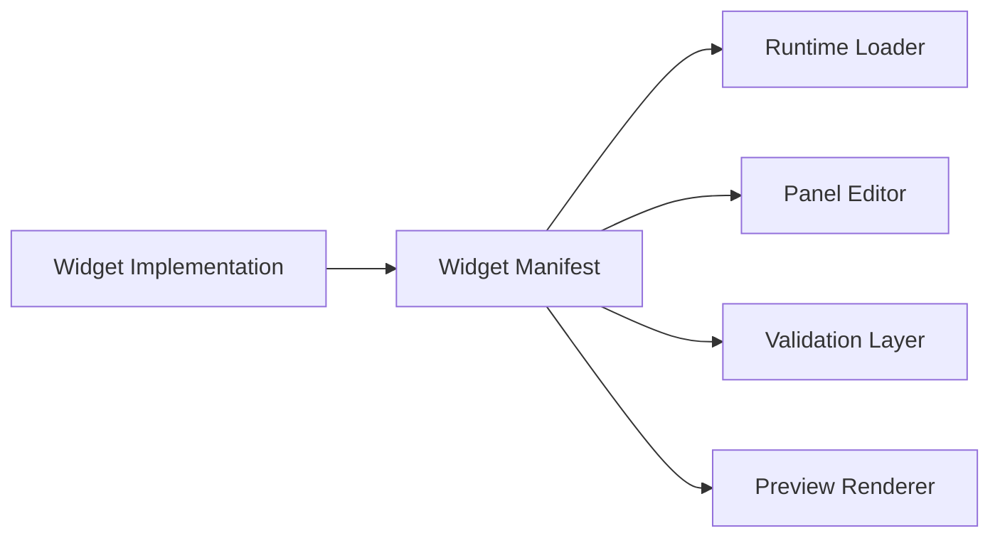

# Widget Manifest Specification

Status: Draft  
Version: 0.1  
Owner: Editor  
Last Updated: 2026-03-12

---

# 1. Purpose

This document defines the **widget manifest and metadata model** used by AstraGauge.

The widget manifest is the contract between a widget implementation and the rest of the platform. It tells the runtime and editor:

- what the widget is
- how it should be displayed in the editor
- what properties it supports
- what bindings it accepts
- what default sizing rules apply
- how it should be previewed and validated

Without a formal widget contract, the editor becomes a swamp of hardcoded special cases. Swamps are fine for frogs. Less fine for software.

---

# 2. Goals

The widget manifest must provide:

- **runtime discoverability**
- **editor discoverability**
- **property schema definition**
- **binding target definition**
- **default sizing and constraints**
- **preview metadata**
- **theme compatibility metadata**
- **versionable widget contracts**

The manifest should allow AstraGauge to load widgets consistently whether they are:

- built-in widgets
- official extension widgets
- community-contributed widgets

---

# 3. Non-Goals

The manifest does not define:

- the rendering implementation itself
- provider behavior
- panel layout rules
- binding engine semantics
- theme file formats

It describes **widget capabilities and editor/runtime integration metadata**, not the widget's internal rendering code.

---

# 4. Architectural Role

The widget manifest sits between the widget implementation and the platform surfaces that need to understand it.



The manifest is consumed by:

- the **runtime** to instantiate and validate widgets
- the **editor** to populate the widget library and inspector UI
- the **validator** to check property and binding correctness
- the **preview layer** to render defaults and placeholders

---

# 5. Widget Identity Model

Every widget must define a stable identity.

Required identity fields:

| Field | Description |
|---|---|
id | stable widget identifier |
name | human-readable display name |
category | widget grouping for editor library |
version | manifest version |
description | short description of widget purpose |

Example:

```json
{
  "id": "core.stat",
  "name": "Stat Tile",
  "category": "basic",
  "version": 1,
  "description": "Displays a primary numeric value with optional label and unit."
}
```

## 5.1 Stability Rules

The `id` must remain stable across versions.

Changing widget IDs breaks panel documents and editor references.

Recommended naming format:

```text
namespace.widget
```

Examples:

```text
core.stat
core.gauge
core.sparkline
community.clock
```

Use lowercase with dot separation.

---

# 6. Required Manifest Sections

A widget manifest should contain these top-level sections:

- identity
- sizing
- properties
- bindings
- preview
- theming
- capabilities
- validation

Example outline:

```json
{
  "id": "core.stat",
  "name": "Stat Tile",
  "category": "basic",
  "version": 1,
  "description": "Displays a primary numeric value.",
  "sizing": {},
  "properties": [],
  "bindings": [],
  "preview": {},
  "theming": {},
  "capabilities": {},
  "validation": {}
}
```

---

# 7. Sizing Metadata

Sizing metadata defines how the widget behaves on the panel grid.

Fields:

| Field | Description |
|---|---|
default_w | default width in grid columns |
default_h | default height in grid rows |
min_w | minimum width |
min_h | minimum height |
max_w | optional maximum width |
max_h | optional maximum height |
resize_mode | how the widget adapts to size changes |

Suggested `resize_mode` values:

- `fixed`
- `responsive`
- `aspect_locked`

Example:

```json
{
  "sizing": {
    "default_w": 3,
    "default_h": 2,
    "min_w": 2,
    "min_h": 1,
    "resize_mode": "responsive"
  }
}
```

## 7.1 Resize Semantics

Widgets must declare how they behave when resized.

Examples:

- a **stat tile** may remain readable across many sizes
- a **gauge** may require minimum dimensions
- a **sparkline** may collapse secondary elements when space is tight

This gives the editor enough information to prevent obviously cursed layouts.

---

# 8. Property Schema

Properties define user-configurable widget settings.

Each property must declare:

| Field | Description |
|---|---|
key | internal property name |
label | editor display label |
type | property type |
required | whether property must be present |
default | default value |
description | optional help text |

Supported base property types:

- string
- number
- boolean
- enum
- color_role
- font_role
- size
- object
- array

Example:

```json
{
  "properties": [
    {
      "key": "label",
      "label": "Label",
      "type": "string",
      "required": false,
      "default": "",
      "description": "Optional label displayed above the value."
    },
    {
      "key": "show_unit",
      "label": "Show Unit",
      "type": "boolean",
      "required": false,
      "default": true
    }
  ]
}
```

## 8.1 Enum Properties

Enums must define allowed values.

Example:

```json
{
  "key": "alignment",
  "label": "Alignment",
  "type": "enum",
  "required": false,
  "default": "center",
  "options": ["start", "center", "end"]
}
```

## 8.2 Property Grouping

Properties may optionally be grouped for editor organization.

Suggested groups:

- general
- layout
- display
- typography
- appearance
- advanced

The editor should use this to build a sane inspector instead of one giant screaming form.

---

# 9. Binding Targets

Bindings define which widget inputs may be connected to sensors or expressions.

Each binding target should declare:

| Field | Description |
|---|---|
key | bindable property name |
label | display name in binding editor |
value_type | expected type |
required | whether binding is required |
multi | whether multiple inputs are allowed |
description | optional help text |

Common binding target examples:

- `value`
- `min`
- `max`
- `series`
- `color_state`
- `secondary_value`

Example:

```json
{
  "bindings": [
    {
      "key": "value",
      "label": "Value",
      "value_type": "number",
      "required": true,
      "multi": false,
      "description": "Primary numeric value displayed by the widget."
    }
  ]
}
```

## 9.1 Binding Type Rules

Recommended binding value types:

- number
- string
- boolean
- series<number>
- color_role
- state
- timestamp

A widget should only expose the bindings it can meaningfully render.

Do not add twelve optional mystery inputs because the future might want them. The future is a bad architect.

---

# 10. Preview Metadata

Preview metadata tells the editor how to show the widget before live bindings are configured.

Fields:

| Field | Description |
|---|---|
mock_kind | type of preview data to generate |
sample_props | example property values |
sample_bindings | example binding placeholders |
placeholder_label | optional empty-state text |

Suggested `mock_kind` values:

- `stat`
- `gauge`
- `timeseries`
- `list`
- `text`
- `custom`

Example:

```json
{
  "preview": {
    "mock_kind": "stat",
    "sample_props": {
      "label": "CPU",
      "show_unit": true
    },
    "sample_bindings": {
      "value": 43.2
    },
    "placeholder_label": "Unbound Stat Tile"
  }
}
```

## 10.1 Preview Requirements

The editor should be able to render a meaningful preview even when:

- no providers are active
- no bindings are configured
- theme selection changes
- the widget is being resized

Good previews make the editor feel alive rather than half-finished.

---

# 11. Theming Metadata

Theming metadata defines how a widget participates in the theme system.

Fields may include:

| Field | Description |
|---|---|
supports_background | whether widget surface is theme-controlled |
supports_accent | whether accent role is used |
supports_threshold_colors | whether state colors are supported |
supports_typography_roles | whether theme typography roles are consumed |
style_slots | named visual slots for theme overrides |

Example:

```json
{
  "theming": {
    "supports_background": true,
    "supports_accent": true,
    "supports_threshold_colors": true,
    "supports_typography_roles": true,
    "style_slots": ["surface", "value_text", "label_text", "trend_line"]
  }
}
```

## 11.1 Theme Discipline

Widgets should consume theme roles rather than raw colors by default.

This preserves cross-theme compatibility and keeps users from building accidental visual war crimes.

---

# 12. Capability Flags

Capabilities allow the platform to adapt editor UI and runtime behavior.

Suggested capability flags:

| Field | Description |
|---|---|
supports_history | widget can display historical values |
supports_thresholds | widget supports threshold-based styling |
supports_multiple_series | widget can render multiple data series |
supports_secondary_text | widget can show a secondary text field |
supports_overlay | widget supports badges or overlays |

Example:

```json
{
  "capabilities": {
    "supports_history": true,
    "supports_thresholds": true,
    "supports_multiple_series": false,
    "supports_secondary_text": true,
    "supports_overlay": false
  }
}
```

Capabilities should describe meaningful behavior, not implementation trivia.

---

# 13. Validation Metadata

Validation metadata defines constraints the editor and runtime can enforce.

Possible fields:

| Field | Description |
|---|---|
requires_value_binding | whether widget must have a primary value |
min_supported_bindings | minimum number of bindings |
max_supported_bindings | maximum number of bindings |
required_props | properties that must be present |
layout_rules | sizing or aspect constraints |

Example:

```json
{
  "validation": {
    "requires_value_binding": true,
    "min_supported_bindings": 1,
    "max_supported_bindings": 3,
    "required_props": [],
    "layout_rules": {
      "min_w": 2,
      "min_h": 1
    }
  }
}
```

## 13.1 Validation Surfaces

The manifest should allow the platform to show validation feedback in:

- widget library
- inspector
- binding editor
- panel diagnostics
- save-time checks

---

# 14. Editor Integration Model

The editor should use widget manifests to drive the authoring experience.

## 14.1 Widget Library

The library uses manifest metadata for:

- display name
- category
- description
- icon reference
- default size
- preview thumbnail

## 14.2 Inspector

The inspector uses property metadata for:

- control generation
- labels
- grouping
- defaults
- validation messaging

## 14.3 Binding Editor

The binding editor uses binding metadata for:

- bindable target listing
- required field display
- accepted type filtering
- validation messages

The goal is for the editor to be **schema-driven** rather than held together with artisanal conditionals.

---

# 15. Runtime Integration Model

The runtime should use widget manifests to:

- resolve widget type IDs
- validate panel documents
- initialize default props
- validate binding targets
- apply widget constraints
- support compatibility checks

This enables safer loading of shared panels.

---

# 16. Versioning and Compatibility

The manifest itself must be versioned.

Recommended fields:

| Field | Description |
|---|---|
version | current manifest version |
compatibility | optional supported runtime/editor range |

Example:

```json
{
  "version": 1,
  "compatibility": {
    "runtime": ">=0.1.0",
    "editor": ">=0.1.0"
  }
}
```

## 16.1 Compatibility Expectations

Minor changes may add optional fields.

Breaking changes should require:

- a new widget manifest version
- migration rules where possible
- stable widget IDs when behavior remains conceptually the same

---

# 17. Suggested File Shape

A widget may be packaged with a manifest file and implementation bundle.

Example:

```text
widget/
  manifest.json
  preview.png
  implementation.bundle
```

The exact packaging format can evolve later, but the manifest should remain a discrete, readable contract.

---

# 18. Canonical Examples

## 18.1 Stat Tile

```json
{
  "id": "core.stat",
  "name": "Stat Tile",
  "category": "basic",
  "version": 1,
  "description": "Displays a primary value with optional label and unit.",
  "sizing": {
    "default_w": 3,
    "default_h": 2,
    "min_w": 2,
    "min_h": 1,
    "resize_mode": "responsive"
  },
  "properties": [
    {
      "key": "label",
      "label": "Label",
      "type": "string",
      "required": false,
      "default": ""
    },
    {
      "key": "show_unit",
      "label": "Show Unit",
      "type": "boolean",
      "required": false,
      "default": true
    }
  ],
  "bindings": [
    {
      "key": "value",
      "label": "Value",
      "value_type": "number",
      "required": true,
      "multi": false
    }
  ],
  "preview": {
    "mock_kind": "stat",
    "sample_props": {
      "label": "CPU"
    },
    "sample_bindings": {
      "value": 43.2
    }
  },
  "theming": {
    "supports_background": true,
    "supports_accent": true,
    "supports_threshold_colors": true,
    "supports_typography_roles": true,
    "style_slots": ["surface", "value_text", "label_text"]
  },
  "capabilities": {
    "supports_history": false,
    "supports_thresholds": true,
    "supports_multiple_series": false,
    "supports_secondary_text": true,
    "supports_overlay": false
  },
  "validation": {
    "requires_value_binding": true,
    "min_supported_bindings": 1,
    "max_supported_bindings": 2
  }
}
```

## 18.2 Sparkline

```json
{
  "id": "core.sparkline",
  "name": "Sparkline",
  "category": "charts",
  "version": 1,
  "description": "Displays a compact historical trend line.",
  "sizing": {
    "default_w": 4,
    "default_h": 2,
    "min_w": 3,
    "min_h": 1,
    "resize_mode": "responsive"
  },
  "properties": [
    {
      "key": "show_fill",
      "label": "Show Fill",
      "type": "boolean",
      "required": false,
      "default": false
    }
  ],
  "bindings": [
    {
      "key": "series",
      "label": "Series",
      "value_type": "series<number>",
      "required": true,
      "multi": false
    }
  ],
  "preview": {
    "mock_kind": "timeseries",
    "sample_bindings": {
      "series": [12, 18, 23, 19, 25, 28, 21]
    }
  },
  "theming": {
    "supports_background": true,
    "supports_accent": true,
    "supports_threshold_colors": false,
    "supports_typography_roles": false,
    "style_slots": ["surface", "trend_line", "trend_fill"]
  },
  "capabilities": {
    "supports_history": true,
    "supports_thresholds": false,
    "supports_multiple_series": false,
    "supports_secondary_text": false,
    "supports_overlay": false
  },
  "validation": {
    "requires_value_binding": false,
    "min_supported_bindings": 1,
    "max_supported_bindings": 1
  }
}
```

---

# 19. Recommended MVP Widget Set

The first official widgets should each have manifests that follow this spec.

Recommended MVP set:

- `core.stat`
- `core.gauge`
- `core.bar_gauge`
- `core.sparkline`
- `core.sensor_list`

That keeps the platform focused while giving the editor enough variety to be genuinely useful.

---

# 20. Future Extensions

Possible future additions to the manifest model:

- editor-side custom controls
- localization metadata
- richer validation expressions
- responsive breakpoint rules
- advanced thumbnail metadata
- migration hints
- grouped binding schemas
- custom inspector sections

These should be added only when a real need emerges, not because architecture astronauts crave another docking ring.

---

# 21. Summary

The AstraGauge Widget Manifest & Metadata Specification defines the contract that allows widgets to be:

- discovered
- configured
- previewed
- validated
- themed
- safely loaded into panels

A schema-driven widget model keeps the runtime and editor coherent, reduces special-case logic, and creates a solid foundation for both official and community widget ecosystems.
